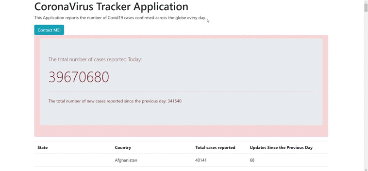

# CoronaVirus Daily Tracking Application         

---------

This Application reports the number of Covid19 cases confirmed across the globe every day. **_Please be responsible wear your masks and stay safe_** :)
                                             

**_Data_** :[The Automated update for delayed COVID-19 data](https://github.com/CSSEGISandData/COVID-19/blob/master/csse_covid_19_data/csse_covid_19_time_series/time_series_covid19_confirmed_global.csv)

**_Techno_** : Spring Boot & Java.

**_Demo_** : For the 18 th October 2020.

**_Run The App_**

1. Clone the repo: https://github.com/Oumaima-Boumlik/CoronaVirus-Daily-Tracker.git
2. Open the folder in your favorite Editor
3. Run the CoronavirusTrackerApplication( path: src/main/java/io/javabrains/coronavirustracker/CoronavirusTrackerApplication.java)
4. Open your localhost browser and Enjoy ^^
